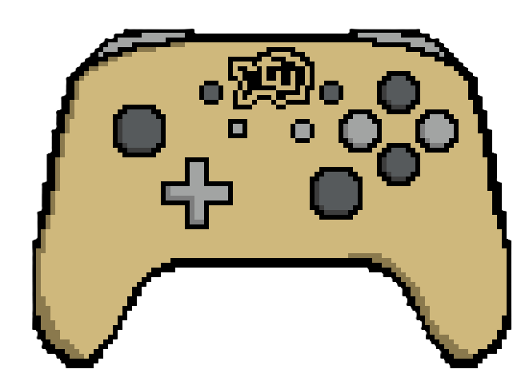

  <h1 style="margin: 0;">CSCI-BuffGames</h1>
  

## Contents
- [Description](#description)
- [Contributors](#contributors)
- [Project Stack](#project-stack)
- [Prerequisites](#prerequisites)
- [How to Run Application](#how-to-run-application)
- [Instructions To Run Tests](#instructions-to-run-tests)
- [Instructions To Play Games](#instructions-to-play-games)
- [External Links](#external-links)
- [Future Work](#future-work)

## Description: 
The Buff Games is a web-based game hub inspired by platforms like NY Times Games, designed specifically for the University of Colorado Boulder community. Our application features a collection of fun, interactive mini-games themed around CU Boulder culture, student life, and landmarks. Players can choose from multiple Boulder-inspired games, compete for high scores, and climb the global leaderboard, which tracks top performers across all games.
As of 4/25/2025, 4 games have been implemented, each with there own leaderboards. Wordle (with CU themed words), CU trivia, CU crossword, and CU geoguesser. The site lets you register an account

## Contributors: 
- [Wilson Narog](https://github.com/WHNarog)
- [Dylan Sandusky](https://github.com/Twinularity)
- [Caden Davis](https://github.com/Anonas3675)
- [Ryan Natvig](https://github.com/ryanrocksforever)
- [Evan Feng](https://github.com/Evancholy1)
- [Logan Oran](https://github.com/OramLogan)

## Project Stack:
+ Frontend
  + HTML (rendering webpage)
  + Handlebars (dynamically rendering webpage)
  + Javascript (making webpages interactive)
  + CSS (rendering webpage)
  + Bootstrap (rendering webpage)
+ Backend
  + Node.js (Runtime environment for running backend JS)
  + Express (writing APIs)
+ DataBase
  + SQL
+ Hosting Website
  + Render

## Prerequisites: 
- Docker Desktop
- WSL (if running windows operating system) (The wsl distribution we used was Ubuntu)

## How to Run Application:
1) Navigate to the ProjectSourceCode directory
2) Run the command "docker compose up" in the terminal (Make sure you have you have created a .env file with the proper elements, or this won't work)
3) Once you see "DataBase connection successful" printed to the terminal, navigate to your web browser and go to [localhost:3000](http://localhost:3000)
4) Register a new account, login and use the website
5) To terminate the application press "ctrl + c". Then run "docker compose down" in your terminal. If you want to delete saved data as well, run "docker compose down -v"

## Instructions To Run Tests:
 - The tests should auto run when the command "docker compose up" is run in the terminal.
 - The output of the tests will print in your terminal. The first test is "Testing Register API Positive". The last test is "Testing Login API Positive"

## Instructions To Play Games:
- Wordle:
  - Almost identical to the wordle created by NYT, with CU based words instead.
  - To type in a word, just type on your computer (no need to select a box). The words will automatically fill starting at the first available box.
  - To delete a letter, press backspace. You can delete up to all the letters in your current row
  - To submit a guess, press enter. After pressing enter, your streak will be updated on the leaderboard. (The streak is how many successfull wordles you have completed in a row)
- Crossword:
  - Select the box you want to type in, and the character you type will be placed in that box
  - To delete a character, select that box and press delete
  - Choose the crossword you want to play by selecting it from the multiple choice box. There are currently only 2 options
  - To check your answers, click the check answer button. Correct letters in green, incorrect letters in red. When everything is correct you will get a point for completing that puzzle
  - To reveal the solution, click reveal solution, points will not be awarded if you reveal the solution.
- Geoguesser
  - Played in rounds of 3, each round you make one guess at the location
  - Total score is the sum of your score for all three rounds. This score is then compared to your previous best aggregate score, the highest of which is placed on the leaderboard
  - To make a guess at the location, click make a guess, then click on the map to place your guess.
  - Once you have placed your guess properly, click confirm guess to check it
- Trivia
  - Select a question difficulty from the mutliple choice selection box, then click new question to load a question of that difficulty
  - After loading a question, select your answer from the four options that appear.
  - If you are correct, your answer is highlighted green
  - If you are incorrect, your anwser is highleted red and the correct answer is show below.
  - The score shown on the leaderboard is your streak, or the highest number of trivia solutions that you have solved consecutively

## External Links
- [Deployed Application](https://software-dev-buff-games.onrender.com/)
- [Video Demo](https://o365coloradoedu-my.sharepoint.com/:v:/g/personal/dysa4879_colorado_edu/EQCTsmN0MMpOnrYyuuG_t8YBpI1IIMmWw56JJFS8VDQIOA)

## Future Work
- Adding a profile page, allowing users to customize and manage their acount
- Add a setting page that would allow users to customize the appearence of the website (DarkMode)
- Add a friends system, so users can compare their statistics with friends
- Include timed gamemodes, allowing users to compete in speed to complete the puzzles
- Create an administrator account that can manage other accounts.
- Add an onscreen keyboard to the wordle, allowing users to more easly track letters used, and making the game playable on mobile
